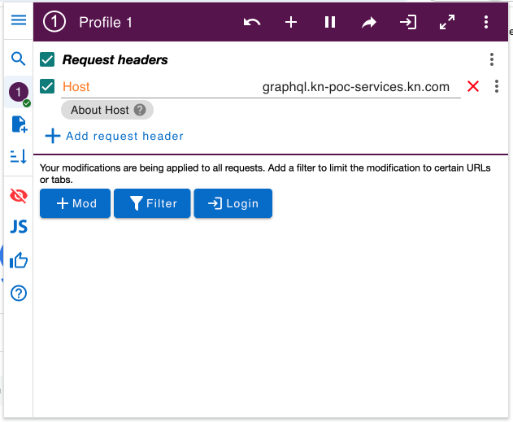
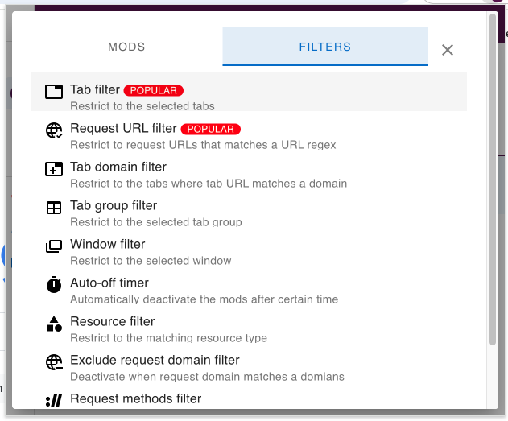
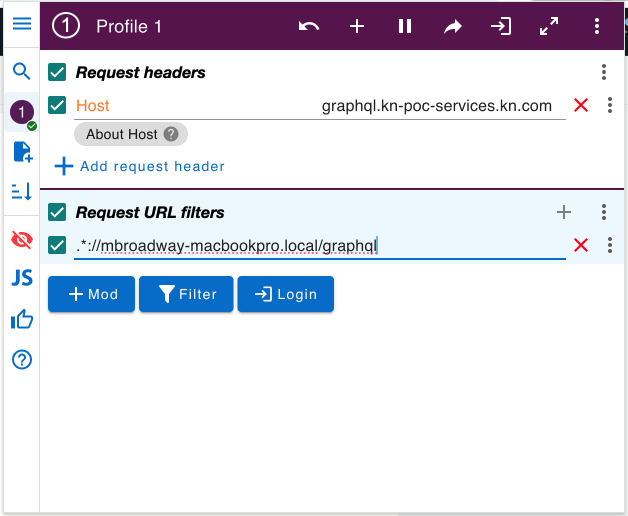

# ModHeader Chrome Extension

[ModHeader](https://modheader.com/modheader) is a Chrome browser extension. This will allow you to set the `Host` 
header on your browser requests to something other than `localhost` in order to have Knative Serving recognize the 
request and trigger a matching on-demand service.

ModHeader is free to use.

**NOTE:** If you use either Safari or Firefox, you will not need to use anything like ModHeader as both of these
browsers pay attention to host names defined in the `/etc/hosts` file.

## Install ModHeader

The **Install ModHeader** button on the [ModHeader](https://modheader.com/modheader) marketing web page will take 
you to the Chrome Web Store where you can install the extension. 

## Configure ModHeader

After installation, click on the ModHeader icon in the Chrome extensions menu (the jigsaw icon in the top right of the
browser window) to open the extension.

### Set the Host header

In the ModHeader popup window, under the **Request Headers** heading, type `Host` as the header name that you wish to 
set in every request, then enter `graphql.kn-poc-services.kn.com` as the header value (or whatever host name you
need to pretend to be targeting).

If **Request Headers** is not visible (it should be the default), click on the **+ Mod** button to see it.

### Set a filter

You won't want this `Host` header to be set on every request, so you will want to set a filter to only apply the 
header to requests from a single browser tab or to a a specific URL path pattern. 

Click the **Filter** button to add a filter from this selection:

Using the Tab filter is the simplest way to apply the `Host` header to all requests from a single browser tab, but it
will be applied for all URLs and not just the ones that get routed to your MiniKube cluster.

Using the URL filter is more complex, but it will allow you to set the `Host` header only for requests to the URLs
that match the pattern you specify. For example:

If you replace the `mbroadway-macbookpro.local` text in the above screenshot with your Mac's host name, then all
requests to `http://\<your-system-name\>.local/graphql` will have the `Host` header set to 
`graphql.kn-poc-services.kn.com` regardless of which browser tab to are on. Meanwhile, requests to other
`http://\<your-system-name\>.local` URLs will route to the `authtest` application services.

