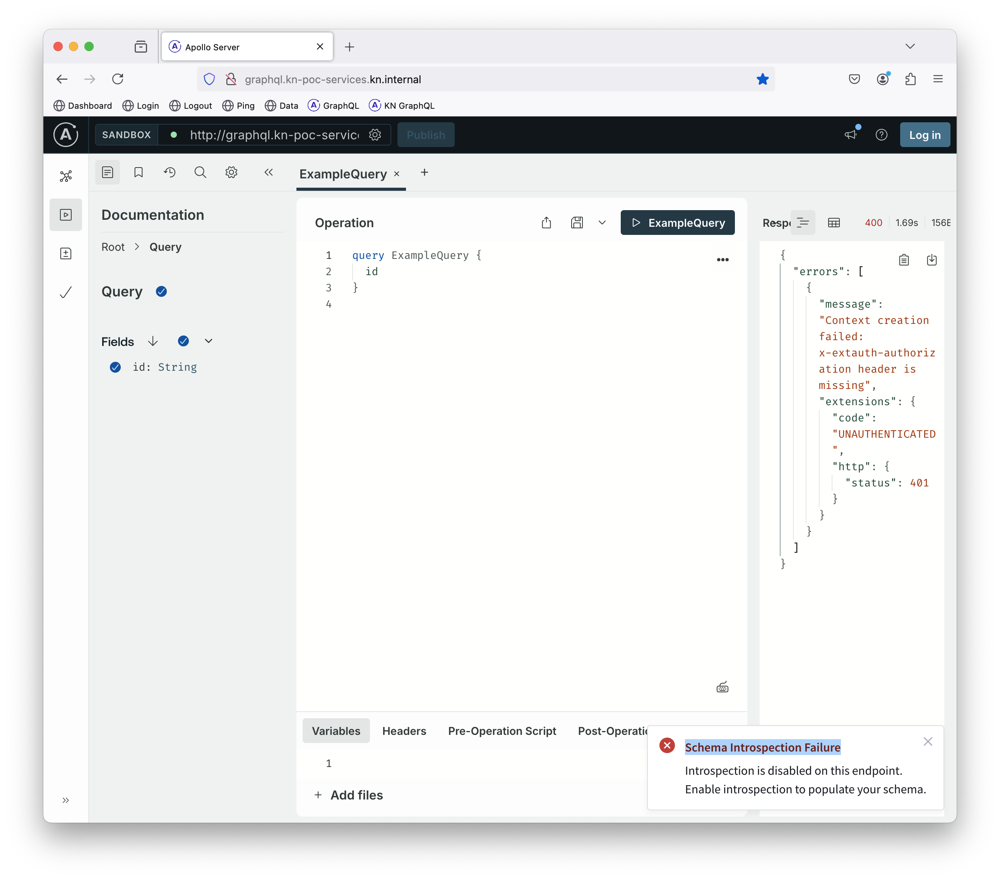

# Build and Deploy the `kn-graphql` Knative Service

The `kn-graphql` service is a minimal Graphql service that includes a Graphiql user interface. 

The service is deployed to an `kn-poc-services` namespace, exposing port 4000.

## Prerequisites

Building and deploying the `kn-graphql` Knative service assumes that you have already completed all the steps 
outlined in [Install Knative on Minikube locally](Installation.md) with Minikube started and its TCP tunnel open.

## Build and manage with `make`

**IMPORTANT:** The following assumes that your current working directory is the [`knative-poc/graphql`](../kn-graphql)
directory.

The easiest way to build, start and manage the `kn-graphql` Knative service is using `make`. Running `make` without any
parameters will display the following usage help:

```text
help          List of available commands
build         Build all of the GraphQL server container in the Minikube package store
deploy        Deploy the container as a Knative service
undeploy      Destroy the deployment/pod/service in Kubernetes
run           Run the service locally with nodemon for auto reload
```

At a minimum, you will want to do the following:

```shell
# Build the docker image and push it to the Minikube package store 
make build

# Deploy and start the container as a service
makde deploy
```

## Build and manage the ~~hard~~ expert way 

**IMPORTANT:** The following assumes that your current working directory is the [`knative-poc/graphql`](../kn-graphql)
directory.

In a terminal shell, run the following:

```shell
# Configure environment variables to instruct docker to target the Minikube
# package store
eval $(minikube docker-env)

# Ensure that all the required npm packages are present
npm install

# Build the docker container image
docker build -t dev.local/kn-graphql:v1 .

# Create the Knative service  
kubectl apply -f kn-service.yaml
```

**IMPORTANT:** The `dev.local/` prefix of the `kn-graphql` image tag is required for Knative Serving to recognize
that the container image is to be found in the local Minikube registry and not in the default `docker.io` registry.

Deploying containers to Minikube outside of Knative Serving does not require this prefix; Minikube naturally assumes
that an unadorned image reference is for the Minikube registry if that addon has been installed. Knative does not
know that it is running under Minikube and behaves as it would when running in any normal Kubernetes cluster.

## Confirm that the service is known to Knative Serving

Run the following:

```shell
kn service list -n kn-poc-services
```

You should see something like this:

```text
NAME      URL                                     LATEST          AGE     CONDITIONS   READY   REASON
graphql   http://graphql.kn-poc-services.kn.com   graphql-00001   8m57s   3 OK / 3     True
```

If you see something like this instead, see **Troubleshooting** below.

```text
NAME      URL                                                LATEST   AGE   CONDITIONS   READY   REASON
graphql   http://graphql.kn-poc-services.svc.cluster.local            12s   0 OK / 3     False   RevisionMissing : Configuration "graphql" does not have any ready Revision.
```

Now run this:

```shell
kubectl get revision -n kn-poc-services
```

You should see something like this:

```text
NAME            CONFIG NAME   GENERATION   READY   REASON   ACTUAL REPLICAS   DESIRED REPLICAS
graphql-00001   graphql       1            True             0                 0
```

If you see something like this instead, see **Troubleshooting** below.

```text
NAME            CONFIG NAME   GENERATION   READY   REASON             ACTUAL REPLICAS   DESIRED REPLICAS
graphql-00001   graphql       1            False   ContainerMissing
```

### Troubleshooting

If you don't see what you expect and some type of error is indicated, then you can get more details with:

```shell
kubectl get revision -n kn-poc-services -o yaml
```

Most likely, your issue will be with one of these conditions:

* The `dev.local/kn-graphql:v1` container image is not present in the Minikube container registry.
* Knative Serving has not been instructed to ignore digest validation of containers in the `dev.local` registry.

You may be able to learn more from the logs of the Knative Server `controller` pod. List the pods in the `knative-serving`
namespace to find the instance name for the controller pod:

```shell
kubectl get pod -n knative-serving
```

Then substitute for the `controller-67c77bd44d-mr8gl` instance name in this (the optional `-f` causes the log to be followed rather 
than just dumping the most recent entries):

```shell
kubectl logs -n knative-serving controller-67c77bd44d-mr8gl -f
```

## Testing

The Istio ingress gateway and Knative Serving are now cooperating to route requests for `graphql.kn-poc-services.kn.com` 
URLs to the `kn-graphql` service. But how can you get a browser to send a request to a URL with that domain name to 
the Minikube cluster running on your laptop? 

To reach Minikube, you need to target a URL in the form `http://<your-system-name>.local`, but that will just go to the 
`authtest` services. To reach the `kn-graphql` service, you need to override the `Host` header of your requests so that  
the Istio ingress gateway recognizes the request as being for the `kn-graphql` service. That's where the ModHeader 
Chrome extension comes in.

See [ModHeader Chrome Extension](modheader.md) for instructions on how to override the `Host` header in some or all of 
your browser requests. Suggestion: configure **ModHeader** to only set the `Host` header to `graphql.kn-poc-services.kn.com`
when the URL matches `.*://<your-system-name>.local/graphql`; that way, you can still reach the `authtest` service with
other URL patterns from any of your browser tabs.

Withe the `Host` header set to `graphql.kn-poc-services.kn.com`, you will be able to reach the Graphiql user interface
and see something like this:



You will not be able to submit a query without getting an authorization error, but at least you know that the Kubernetes
ingress gateway routed your request correctly. Authorization is the next step.

Don't worry if you see a "Schema Introspection Failure" and "Unable to reach server" projected on top of the Graphiql 
display, that's just because you have not provided authorization credentials. If you can see a Graphiql sandbox 
display and not a 404 error, you are good to go.

## Testing with `curl`

Using `curl`, you can test the service without the need for the ModHeader Chrome extension to fake the `Host` header. 
Run the following:

```shell
curl -X POST http://localhost/graphql \
  -H "Host: graphql.kn-poc-services.kn.com" \
  -H "Cookie: session=Mickey Mouse" \
  -H "Content-Type: application/json" \
  -d '{"query": "query { getPerson(id: \"59f5d2b5-ee04-4e1a-9a68-f11a90b1665a\") { id familyName givenName displayName } }"}'
```

The faked `Host` header will cause the Istio ingress gateway to route the request to the `graphql` service, while the
`Cookie` header will provide the authorization credentials needed to access the service. The ingress gateway will
recognize the session cookie and generate a session JWT token that the `kn-graphql` service will accept.

You should get JSON back from the GraphQL service that looks like this:

```json
{"data":{"getPerson":{"id":"59f5d2b5-ee04-4e1a-9a68-f11a90b1665a","familyName":"Potter","givenName":"Harry","displayName":"Harry Potter"}}}
```

The `getJwtSubject` function in the `kn-graphql` service will extract the `sub` claim from the JWT token and return
that. Check that out with this `curl` command:

```shell
curl -X POST http://localhost/graphql \
  -H "Host: graphql.kn-poc-services.kn.com" \
  -H "Cookie: session=Mickey Mouse" \
  -H "Content-Type: application/json" \
  -d '{"query": "query { getJwtSubject }"}'
```

## Next ...

Now we want to add a simple gRPC service that the GraphQL service can call. See [Build and Deploy the `kn-grpc-ping` Knative Service](svc-grpc.md).
```

